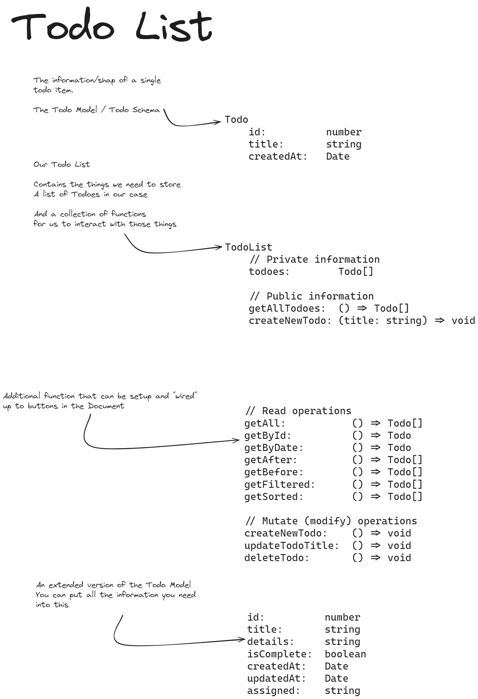

# Blog and Todo List example

Here we are combining the primitive building blocks from previous lectures:

- Variables & Data Types
- Conditionals
- Loops
- Functions & Methods
- Event Handling

Into larger structures which accomplishes something more, we are starting off with two examples

1. [A Blog display](./blog-display/)

  We have a list of blog Articles and want to create a list of HTML elements from that data set

2. [A Todo List](./todo-list/)

  A starting implementation of a Todo List or Task List.

  